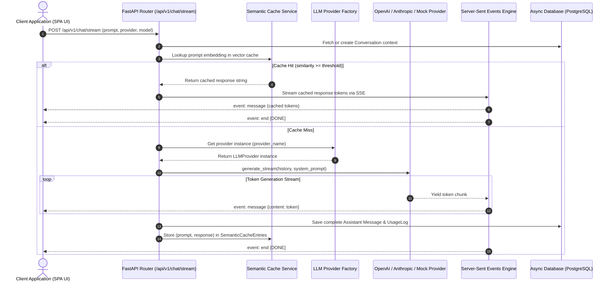
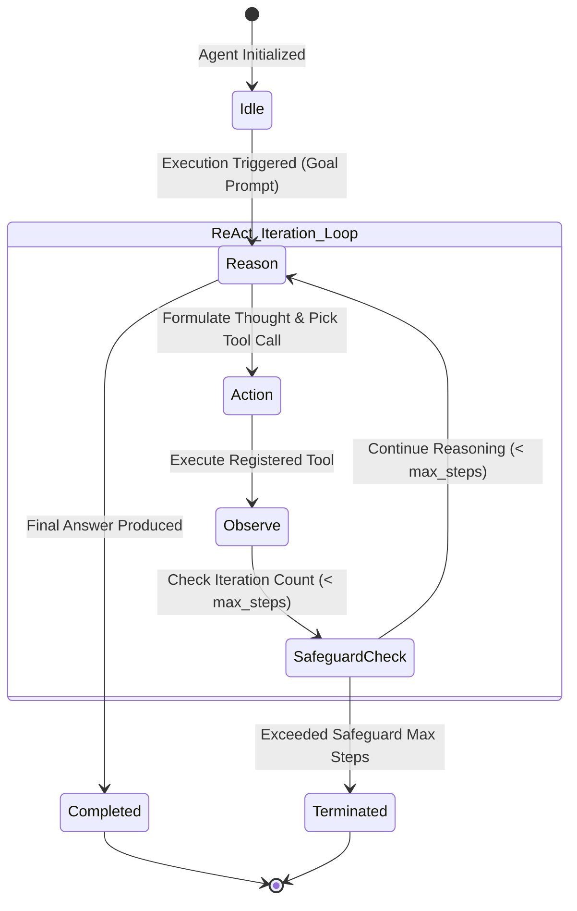

# Architecture Documentation — ForgeAI Enterprise Platform

This document details the core subsystem sequence workflows, architectural component layouts, and data execution flows for **ForgeAI**.

---

## 1. Multi-Model LLM Streaming & SSE Engine Workflow



---

## 2. RAG Knowledge & Vector Search Pipeline Workflow

```mermaid
graph TD
    subgraph Ingestion["1. Document Ingestion Pipeline"]
        A[User Uploads PDF/TXT File] --> B[RAG Service Document Processor]
        B --> C[Chunking Engine: 500 Tokens / 50 Overlap]
        C --> D[Embedding Generator: Mock/OpenAI Embeddings]
        D --> E[(Vector Knowledge Collection)]
    end

    subgraph Retrieval["2. Query Retrieval & Context Augmentation"]
        F[User Query Prompt] --> G[Generate Query Embedding Vector]
        G --> H[Cosine Similarity Search against Collection]
        H --> I[Extract Top-K Most Relevant Chunks]
        I --> J[Construct System Prompt with Injected RAG Context]
        J --> K[LLM Provider Generation Endpoint]
    end

---

## 3. Vector Database Storage Abstraction

```mermaid
classDiagram
    class KnowledgeCollection {
        +String id
        +String user_id
        +String name
        +String description
        +List~DocumentChunk~ chunks
    }
    class DocumentChunk {
        +String id
        +String collection_id
        +String content
        +List~float~ embedding
        +Dict metadata
    }
    class RAGService {
        +create_collection(name, user_id)
        +ingest_document(collection_id, file_content)
        +query_similar_chunks(collection_id, query_text, top_k)
    }

    RAGService --> KnowledgeCollection : Manages
    KnowledgeCollection "1" *-- "many" DocumentChunk : Contains
```

---

## 4. ReAct Autonomous Agent Loop State Machine



---

## 5. Semantic Prompt Caching & Similarity Lookup Engine

```mermaid
flowchart TD
    In[Incoming User Prompt] --> Hash[Generate SHA256 & Embedding Vector]
    Hash --> Lookup[Query SemanticCacheEntries for (user_id, provider, model)]
    Lookup --> Compare{Similarity Score >= Threshold (0.92)?}
    Compare -- Yes (Cache Hit) --> HitReturn[Return Cached Response (<10ms Latency, $0 LLM Cost)]
    Compare -- No (Cache Miss) --> LLM[Invoke External LLM Provider]
    LLM --> StoreCache[Store Prompt + Response + Embedding in DB]
    StoreCache --> OutReturn[Return Fresh LLM Response to User]
```
```
